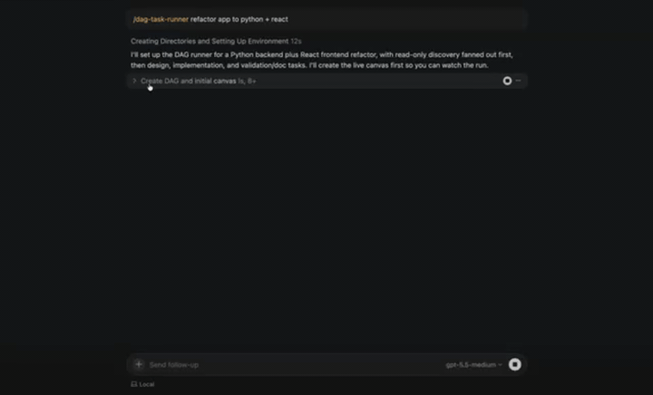

# DAG 任务编排器

将任务拆解为 JSON DAG（有向无环图），以拓扑顺序将每个节点作为 Cursor SDK 本地子 Agent 运行，并将实时状态流式输出到 [Cursor Canvas](https://cursor.com/docs/canvases)，每次状态变更时 Canvas 自动热重载。



> 以上为 Canvas 的运行录制。每次编排器将新状态写入磁盘时，IDE 都会重新渲染 Canvas，因此你可以实时看到任务依次经过 `PENDING → RUNNING → FINISHED/ERROR` 状态。

## 功能说明

- **编写 DAG**：以带有显式 `depends_on` 依赖边和每任务 `complexity`（HIGH / MED / LOW）的子任务定义 DAG，编排器通过可配置的默认值将其映射到 Cursor 模型。
- **拓扑排序**：将 DAG 按层级排序（Kahn 算法），并通过 `Promise.all` 并发执行同层级任务，独立任务自动并行执行。
- **上游输出拼接**：将上游输出自动注入到子任务的提示词中——每个子任务会自动获取每个父任务结果的 2,000 字符摘要，无需手动描述。
- **实时流式输出**：写入 `.canvas.tsx` 文件。每次写入时 Cursor 重新编译 Canvas，因此你在每个任务卡片上可以看到逐 token 的输出内容。
- **安全容错**：超时将任务标记为 `ERROR` 而非挂起，下游依赖自动跳过，SIGINT/SIGTERM 会取消正在执行的子 Agent 并在退出前完成 Canvas 写入。

## 开始使用

需要 Node.js 22 或更高版本。

安装依赖：

```bash
pnpm install
```

设置 Cursor API Key：

```bash
export CURSOR_API_KEY="crsr_..."
```

渲染初始 Canvas（无需 API Key），以便在运行前打开它：

```bash
pnpm init-canvas
open .canvas/dag-example.canvas.tsx
```

端到端运行示例 DAG：

```bash
pnpm example
```

该示例构建了一个微型单文件 CLI 待办事项应用。任务默认在 `process.cwd()` 下运行，如果不想在 cookbook 目录中生成文件，请使用临时目录：

```bash
mkdir -p /tmp/dag-demo && cd /tmp/dag-demo
CURSOR_API_KEY="crsr_..." \
  pnpm --dir ~/Code/cookbook/sdk/dag-task-runner \
  dev -- --dag examples/example_dag.json --canvas-path "$PWD/dag-example.canvas.tsx" --cwd "$PWD"
```

观察 [`dag-example.canvas.tsx`](./examples/example_dag.json) 随每个层级的执行实时刷新：

```
[dag-runner] DAG "构建一个微型 CLI 待办应用" — 6 个任务跨越 4 层
[dag-runner] rank 1/4: research-stack, research-cli-conventions
[dag-runner] rank 2/4: design
[dag-runner] rank 3/4: implement
[dag-runner] rank 4/4: tests, docs
[dag-runner] 完成 — 6/6 成功，耗时 1 分 47 秒
```

## DAG 结构

```json
{
  "title": "构建一个微型 CLI 待办应用",
  "models": {
    "HIGH": "gpt-5.3-codex",
    "MED": "composer-2",
    "LOW": "auto-low"
  },
  "tasks": [
    {
      "id": "research-stack",
      "depends_on": [],
      "complexity": "LOW",
      "subtask_prompt": "勾勒最小可行设计方案……"
    }
  ]
}
```

| 字段 | 必需 | 说明 |
|------|------|------|
| `id` | 是 | 唯一的短横线命名标识符，供其他任务的 `depends_on` 引用 |
| `depends_on` | 是 | `id` 数组。第一层任务为空数组。检测到循环引用时拒绝解析 |
| `complexity` | 是 | `HIGH`、`MED` 或 `LOW`。通过下方的模型映射表解析 |
| `subtask_prompt` | 是 | 自包含的提示词——编排器会自动在开头拼接上游输出摘要 |
| `models` | 否 | 顶层部分复杂度 → 模型覆盖映射 |

参见 [`examples/example_dag.json`](./examples/example_dag.json) 获取完整示例。

## 复杂度模型映射

默认情况下，复杂度映射关系如下：

| 复杂度 | 默认模型 |
|--------|----------|
| `HIGH` | `gpt-5.3-codex` |
| `MED` | `composer-2` |
| `LOW` | `auto-low` |

你可以在 DAG 文件中以顶层 `models` 对象覆盖任意子集，或将可复用的配置保存在 JSON 文件中：

```json
{
  "HIGH": "gpt-5.3-codex",
  "MED": "composer-2",
  "LOW": "auto-low"
}
```

然后运行：

```bash
pnpm dev -- --dag examples/example_dag.json --models-file ./models.fast.json --canvas-path "$PWD/.canvas/dag-example.canvas.tsx"
```

优先级顺序为：默认值 < DAG `models` < `--models-file`。Cursor SDK 的模型目录因账户而异；官方 SDK 文档建议使用 `Cursor.models.list()` 确认有效的模型 ID。

## CLI 参数

| 参数 | 默认值 | 说明 |
|------|--------|------|
| `--dag` | 必填 | DAG JSON 文件路径 |
| `--canvas-path` | 自动拼接 | Canvas 文件的完整绝对路径。推荐用于父进程管理流程 |
| `--canvas` | — | Canvas 文件名主干（不含 `.canvas.tsx`）。仅在未指定 `--canvas-path` 时使用 |
| `--canvases-dir` | 按工作区 | 覆盖 Canvas 输出目录。仅与 `--canvas` 配合使用 |
| `--cwd` | `process.cwd()` | 每个子 Agent 的工作目录 |
| `--models-file` | — | 包含部分复杂度 → 模型覆盖映射的 JSON 文件 |
| `--init-only` | `false` | 写入初始全 `PENDING` 状态的 Canvas 后退出。无需 `CURSOR_API_KEY` |
| `--debounce` | `200` ms | Canvas 写入防抖间隔 |
| `--task-timeout-ms` | `1200000`（20 分钟） | 超过此时长将任务标记为 `ERROR` |
| `--stream-publish-ms` | `500` ms | 实时 Canvas 流式写入限流间隔 |
| `--stream-idle-timeout-ms` | `300000`（5 分钟） | 在此窗口内未收到流事件则将任务标记为 `ERROR` |

## 作为 Cursor Skill 使用

本仓库附带了一个立即可用的 Skill，位于 [`../../.cursor/skills/dag-task-runner`](../../.cursor/skills/dag-task-runner)。将其复制到另一个项目或您的个人 Skill 文件夹：

```bash
# 为另一个项目添加项目级 Skill
mkdir -p /path/to/project/.cursor/skills
cp -R .cursor/skills/dag-task-runner /path/to/project/.cursor/skills/

# 添加跨工作区可用的个人 Skill
mkdir -p ~/.cursor/skills
cp -R .cursor/skills/dag-task-runner ~/.cursor/skills/
```

复制的 Skill 包含 `SKILL.md`、`examples/` 和 `scripts/` 运行时目录。不包含 `node_modules`；Skill 的说明会在首次使用时自动在 `scripts/` 中安装依赖。

Skill 按以下顺序自动检测编排器路径：

1. `DAG_RUNNER_DIR` 环境变量（如已设置）
2. `<当前工作目录>/.cursor/skills/dag-task-runner/scripts`
3. `<Git 根目录>/.cursor/skills/dag-task-runner/scripts`
4. `~/.cursor/skills/dag-task-runner/scripts`

## 同步可复制制品

保持 [`../../.cursor/skills/dag-task-runner`](../../.cursor/skills/dag-task-runner) 与 SDK 源码同步：

```bash
./scripts/sync-copyable-skill.sh
```

修改 `src/`、`skill/SKILL.md`、`examples/`、`package.json` 或 `tsconfig.json` 后运行此命令。

## 项目结构

```
sdk/dag-task-runner/
├── README.md                     # 英文原版
├── README.zh-CN.md               # 中文翻译
├── package.json                  # @cursor/sdk ^1.0.9, tsx, typescript
├── tsconfig.json
├── pnpm-workspace.yaml
├── src/
│   ├── run_dag.ts                # 入口点 + 每任务生命周期
│   ├── dag.ts                    # 解析、校验、循环检测、拓扑排序
│   └── canvas_writer.ts          # 防抖 .canvas.tsx 渲染器
├── examples/
│   └── example_dag.json          # 6任务"微型 CLI 待办应用"示例 DAG
├── docs/
│   ├── dag-canvas-preview.png    # Canvas 截图
│   └── demo_vid_dag.gif          # 本 README 中使用的动画 Canvas 演示
├── skill/
│   └── SKILL.md                  # 可复制 Skill 说明的来源
└── scripts/
    └── sync-copyable-skill.sh    # 重新生成 ../../.cursor/skills/dag-task-runner/
```

## 说明

- 编排器使用本地 Cursor SDK 运行时——每个子 Agent 在 `--cwd` 目录下运行（默认为调用编排器的位置）。
- 同一层级的兄弟任务并行执行；请勿让它们写入相同文件。
- 每任务流式文本限制为 4,000 字符，传递给子任务的上游上下文限制为每个父任务 2,000 字符，以保持 Canvas 文件大小适中。
- 如需更深入的 API 介绍，请参见 [Cursor SDK TypeScript 文档](https://cursor.com/docs/api/sdk/typescript) 和同级目录下的[快速开始](../quickstart)示例。
